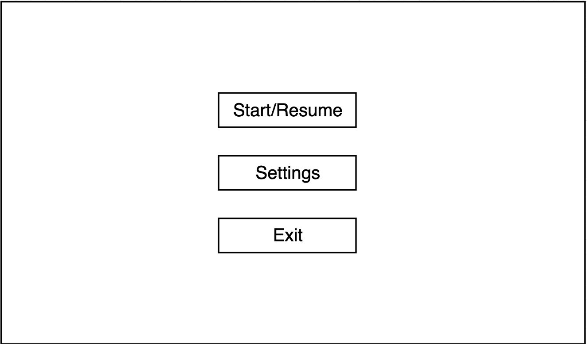
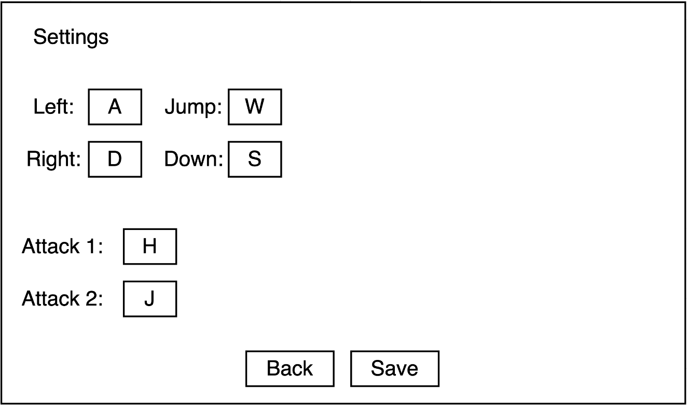
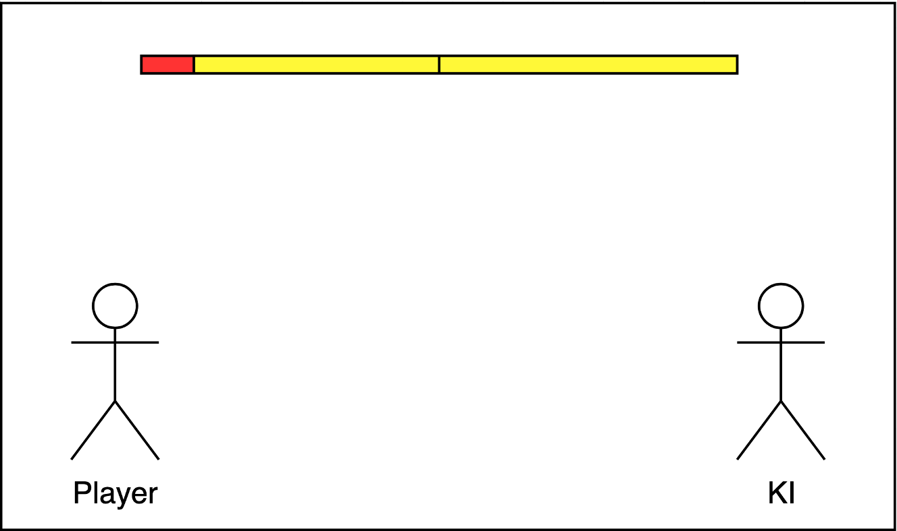

# Entwicklung

## Wireframe

Für eine erste visuelle Ansicht wurden Wireframes vom Game, Menü und den Startmenü Settings erstellt.

### Menü

Ein Menü soll dazu dienen Einstellungen vorzunehmen und das Game zu pausieren.

### Menü Settings

In den Menü Settings kann man die Keybinds für die verschiedenen Inputs wie Attacken und Bewegungen setzen.

### Game

Dieses Wireframe stellt das eigentliche Spiel dar.

Zwei Lebensbalken können oben in der Mitte gesehen werden.
Die Lebensbalken von beiden Spielern sind durch eine schwarze vertikale Linie getrennt.
Der linke Lebensbalken ist für den linken Spieler und der rechte Lebensbalken für den rechten Spieler.
Gelb gefärbt ist das Leben des Spielers und rot das verlorene Leben.

## Probleme

### KI

Eine KI zu implementieren würde den zeitlichen Rahmen sprengen, dadurch wird der Kompromiss eingegangen den zweiten Spieler durch einen Menschen zu steuern.

Durch diesen Kompromiss gibt es eine Veränderung von den Menü Settings.
Es muss auch dem zweiten Spieler möglich seinm seine Keybinds zu ändern.
